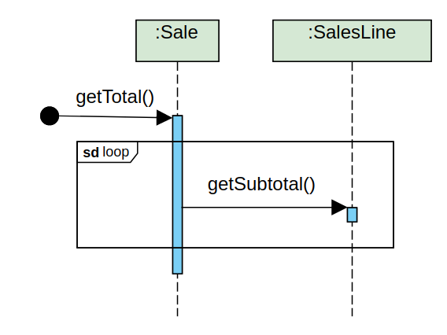

# Analysis diagrams

## Use case diagram

This is a sample for inlcuding a diagram. Replace it with the correct diagram. All images of diagrams should be in the img folder. Provide good names to images (i.e. type of diagram_name of diagram).

## Use case texts

## System sequence diagrams

## Conceptual Class Diagram

